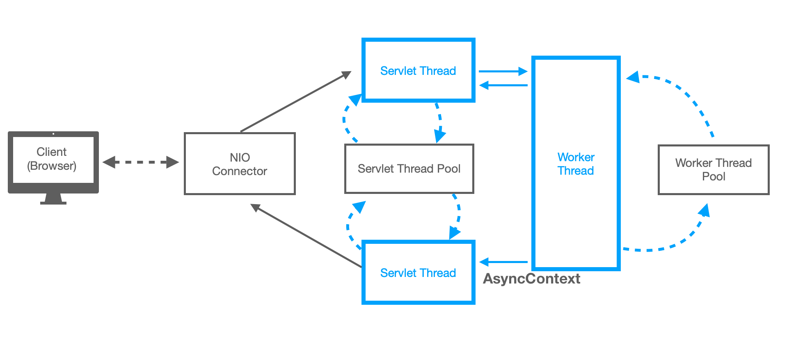

Toby님의 유튜브 강의를 보며 공부한 자료(그대로 따라한 것임)  
[>link](https://www.youtube.com/channel/UCcqH2RV1-9ebRBhmN_uaSNg)

# Async vs Sync

# Non-Blocking I/O vs Blocking I/O

# Thread
### ServletThread
> 웹 요청을 처리하기 위해 할당하는 스레드

### WorkerThread
> 작업을 처리하기 위한 스레드

### NIO,Async Cycle (Worker Thread, Servlet Thread)
